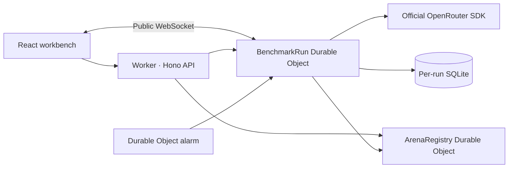

# Architecture

GameBench treats a benchmark as a saved experiment with autonomous execution. React reads snapshots and listens for progress; opening a page never starts the game loop.

## Request and execution flow

A run captures its model IDs, prices, protocol version, and inference settings. The scheduler creates every pairing in both seat orders per repetition. Version one executes matches sequentially within each run. Separate runs have independent Durable Objects and may execute concurrently.

The `BenchmarkRunner` advances one inference request per tick. Before sending, it persists a pending request with an ID, turn, start time, and cost reserve. Completion atomically stores the attempt and resulting match state. Operator commands are re-read after inference so a pause or cancellation takes precedence; discarded responses still contribute their usage and cost.

Durable Object alarms schedule the next tick, including when no browser has ever connected. A cold object that finds a pending request records it as interrupted and pauses rather than silently send a potentially billed request again. An index failure may retry an alarm, but an already committed move is never reapplied. The run itself is authoritative; the global run list is a summary index that can briefly lag behind it.

## Live viewing and replay

`/api/runs/:id/live` upgrades to a hibernating WebSocket. New spectators receive a snapshot and any currently cached progress. During inference, the SDK's response content and returned reasoning are broadcast in bounded, throttled frames. These are model-supplied fields; encrypted or unavailable reasoning cannot be displayed.

The completed attempt stores the raw response, readable reasoning, explanation, outcome, timing, usage, cost, and provider identifiers when available. Snapshots update the board; recorded accepted moves drive replay. Reconnection uses backoff, while HTTP refreshes provide a fallback for positions and results. The spectator channel has no mutation commands.

JSON exports capture the snapshot and an attempt cutoff together, then stream the matching rows in bounded pages. New moves after that cutoff belong to a later export. Model credentials and admin tokens never enter the run record.

## Adding another game

Implement `GameAdapter` in `server/src/core/game.ts`:

- A stable ID, display name, protocol version, and two seat names.
- An initial opaque serialized state.
- An observation containing the current seat, prompt, legal actions, and renderable view.
- An action application that returns the next state and an optional final score.

Register the adapter in `server/src/games/chess.ts` (move the registry to its own module when a second adapter lands), then add the game selection and spectator renderer to the frontend. The runner, request receipts, budget accounting, storage, exports, and alarm orchestration remain shared. The current contract is for two-player games; multiplayer or simultaneous-action games need an explicit extension.

Chess stores full PGN rather than reconstructing from FEN alone, preserving repetition history. Legal actions use SAN. Chess rules stay in the adapter; the runner owns retries, limits, forfeits, and scheduling.

## Runtime boundaries

The deployed Worker imports no Node server code. SQL queries use Durable Object `storage.sql`, with synchronous transactions for snapshot/attempt commits. Local development replaces only the platform and database boundary: native Node SQLite, a background timer, and `ws` use the same game adapters and runner.

Hono is the HTTP boundary, TanStack Query owns browser server state, and the official OpenRouter SDK is the provider boundary. A server-rendering framework or another AI abstraction is not required to keep these lifecycles correct.
